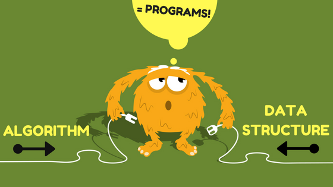

# Data Structure And Algorithms

  
   
   
   

## Data Structures 

- Arrays: A sequential collection of elements of the same data type stored in contiguous memory locations, allowing random access and efficient retrieval of elements using indexing.

- Linked Lists: A linear data structure composed of nodes, where each node contains a data element and a reference (pointer) to the next node in the sequence. Linked lists support dynamic memory allocation and efficient insertion/deletion operations.

- Stacks: A Last-In-First-Out (LIFO) data structure that allows elements to be inserted and removed from only one end, known as the top. Common operations include push (insertion) and pop (removal).

- Queues: A First-In-First-Out (FIFO) data structure that allows elements to be inserted at the rear (enqueue) and removed from the front (dequeue). It follows the principle of "first come, first served."

- Trees: A hierarchical data structure composed of nodes, where each node has a value and zero or more child nodes. Common types include binary trees, binary search trees, and balanced trees like AVL trees and B-trees.

- Heaps: A specialized tree-based data structure that satisfies the heap property, which specifies the relationship between parent and child nodes. It can be a min heap (the smallest element is at the root) or a max heap (the largest element is at the root).

- Hash Tables: A data structure that implements an associative array abstract data type, mapping keys to values using a hash function. It allows for efficient insertion, deletion, and lookup operations.

- Graphs: A non-linear data structure consisting of vertices (nodes) and edges (connections) between them. Graphs can be directed or undirected and may have weighted or unweighted edges.
